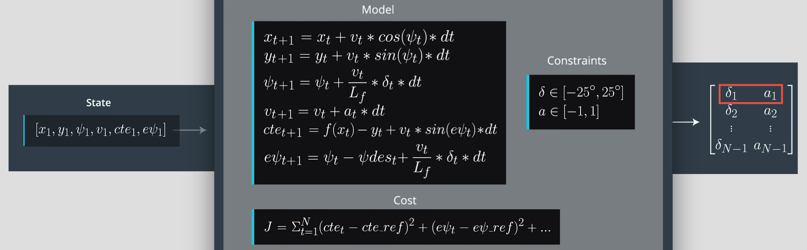
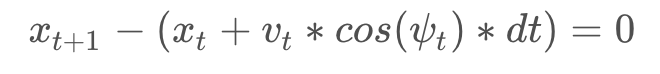

# PID Control Project

[](http://www.udacity.com/drive)


<!--  -->
<p align="center"></p>


Overview
---


In this project we are going to use Model Predictive controller to steer and accelerate a vehicle in a simulation environment without human intervention. 


Pipeline
---


*The overall pipeline along with the results will be described here!*

<br>

I. The following image shows the overall block diagram of the underlying algorithm. Model Predictive Control (MPC) uses control inputs that minimizes the cost function. Before starting the MPC algorithm we set up duration of the trajectory, this means setting up N and dt. We talk about choosing appropriate N and dt in the next section. Once we choose N and dt, we define vehicle model and constraints as shown in the following diagram. We have two types of constraints, one type is the actuator limitations delta(steering angle) and a(acceleration or brake). The other constraint is the model equation itself, as an example constraint on x is shown in the following equation. Next step is defining the cost function. I will talk about cost function in detail in the following sections. Once we set up all these variable, we begin the state feedback loop. First we pass the current state to the MPC solver. The model uses initial state, model, constraints, and cost function to return a vector of control inputs that minimizes the cost function. We just pick the first control input to the vehicle and discard all others. We repeat the loop.


</br>
<p align="center"></p>
</br>
II. Also the following equation shows an example of enforcing the constraint. This is for vehicle x location. We do the same for other equations in our model.
</br>
</br>
<p align="center"></p>


III. There are 7 types of cost functions that we defined here. Cost functions include a) cross track error b) orientation of the vehicle c) deviation from the refrence speed(60) d) Steering Value e) Acceleration f) Differential Steering g) Differential Acceleration. The trickiest part of this project was choosing the right coefficient for each of the 7 cost functions. For example cost coefficient for the Differential Steering was very important for the vehicle to steer correctly around the curb.


</br>


IV. Values for dt and N are chosen empirically. First I started with the values that I used them in the course quize N = 25 and dt = 0.05. However, it seemed this value for dt is very low and the vehicle became very unstable specially the steering angle. By changing dt to 0.1, steering angle became less sensitive to temporal changes and as a result vehicle became more stable. I tweaked with different values of N as well and it seems N = 20 works the best. This means that the vehicles knows the next 2 seconds of it's state. Given the curves of this route, it is a reasonable value.


</br>

V. Before passing the waypoints to the solver, a polynomial is used to fit the updated vehcile location. Given the global x,y positions of the waypoints and global x,y position of the vehicle, vehicle coordinate gets updated. The updated points are used to fit a polynomial to the vehicle path in order to calculate orientation(epsi) and cross track error(cte). Cte and epsi are used to calculate the current state of the vehivle as shown in the follwing code snippet.

```cpp
const double dt = 0.1;
const double Lf = 2.67;
double px_est = 0.0 + v * dt;
const double py_est = 0.0;
double psi_est = 0.0 + v * -steering / Lf * dt;
double v_est = v + throt * dt;
double cte_est = cte + v * sin(epsi) * dt;
double epsi_est = epsi + v * -steering / Lf * dt;
``` 


</br>

VI. Latency of 100 microsecond is considered. Before passing the states to the solver, all the states are getting updated based on the latency of 0.1 second. For example the next cross track error becomes cte + v * sin(epsi) * dt in which dt is the latency of 0.1 second. 


VII. Final video of the result is provided below. Please click on the following image to view the full video on YouTube. 
</br>

[](https://www.youtube.com/watch?v=YQtIvUIr9Bc)

</br>
<br></br>